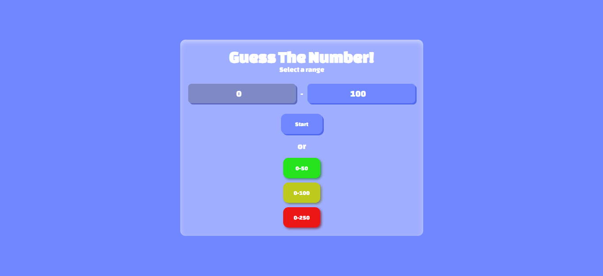

# Guess The Number!

In this little game, you have to try to guess the chosen number! You can select one of the pre-selected ranges, or customize your own! The game features visual and sound effects!

## Why did I create it?

I decided to create this to challenge myself again to make a Guess The Number game, but this time, I tried my best! I though about the sound and visual effects, and because I personally like small games like this, especially ones i create myself :3

## How to play?

- On the home page you can select one of the 3 pre-selected ranges, or, in the first one, which by default appears as "0 - 100", you can only customize the "100" to any non-negative/non-zero number.
- From here, everything begins! You have to click on the box/input that says "Your Guess" and just type in your guess! The game will keep track of all the information each time you try, such as remaining lives and attempts. And don't worry, the game will let you know if your guess is lower/higher than the random number!
- Now two things can happen! 1. You win and the game produces sound and visual effects and restarts, or 2. You lose :( and the game produces sound and visual effects and restarts as well!

## What does each function in `script.js` do?

- `wrongScreenAnimation()`: This function simply produces the visual effects when you don't guess it correctly!
- `winScreenAnimation()`: This function simply produces the visual effects when you guess it correctly!
- `randomNumber(max)`: This funcion takes one argument, `max`, generates a random number between `0` and `max`, and returns it!
- `handleStartScreen()`: When you select your range on the main screen, this function swiches to the next screen and, as a precaution, disables all buttons on the previus screen (main screen). This function also sets the random number variable to its value and displays your lives!
- `handleCustomRange()`: This function, wich is only activated when you choose a custom range, generates your custom number of lives, specifically using the formula `Math.floor(max / 6) + 5`, and also displays your lives!
- `resetGame()`: This function does exactly what its name says, it resets the game, more precisely when you win/lose automatically. It resets all variables so that nothing from the previous game interrupts your new game.
- `winOrLoseControll(screenType)`: This function takes the `screenType` argument, wich refers to wich screen the code should be applied to. If applied to `winScreen`, it switches the current screen to the victory screen, produces a sound effect, and automatically restarts the game using the `resetGame()` function. The same thing happens to the losing (`loseScreen`), but with a different sound effect and to a different screen.
- `controllGame()`: This is the main function, it analyzes your guess and checks if it's greater/less than the mystery number and tells the user if the number is greater/less. This function also handles checking if the user won or lost, updates their lives and attempts and displays them, and finally, clears the user input.

## Things that might help:
- If you press `Enter` on the guess input, it handles that too! It might even be better to just press `Enter`, it's faster.